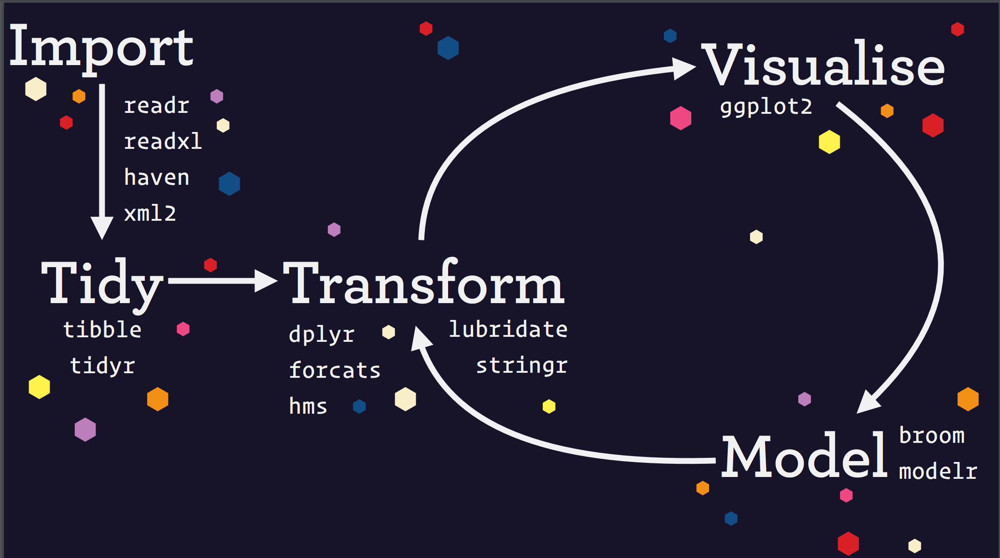

### What is tiingo? 

Tiingo was formed in 2014 and holds that belief that love is the ideal way to conduct business. We are a team made up of artists, engineers, and algorithmic hedge fund traders.  More description from Rishi.

### What is R and RStudio? 

R is an open-source statistical programming language that is growing very fast in the world of data science. 

To download R, go to: 

https://cloud.r-project.org

and then click on the link for either Mac, Windows or Linux depending on your computer. 

To install RStudio, go to: 

http://www.rstudio.com/download

RStudio is an integrated development environment (or IDE) for R programming. It makes writing and running R code more fun. 

If all of that is a bit confusing, have a look at this section from *R for Data Science*: 

r4ds.had.co.nz/introduction.html#prerequisites


### Packages

R the programming language consists of base R and the packages that have been built on top of it. Once you have downloaded base R onto your computer and installed RStudio, you need to install the packages we will be using for this workshop.

To install a package on your computer, run `install.packages("name of package")`. To use that package, place `library(name of package)` at the top of your R script or RMarkdown file and run it.

Here are the commands to get the packages for today's workshop.


### Rmarkdown

The file we are looking at and using today is called an `RMarkdown` file. It's a file format that let's us interweave code chunks that look like this: 

```{r}
plot(mtcars)
```

Along with plain text prose, which is what we are reading right now. We can then `knit` this to a PDF, an HTML file or a Notebook. We could have used an R script, which would have the file extension `.R`. Click `file` -> `New File` -> `R Script` to open an R script. Click `file` -> `New File` -> `R Notebook` to open an Rmarkdown Notebook.

# Data Science Paradigm




### Load the packages
All my R Notebooks start with this step. We need our tools! 

```{r setup, message = FALSE, warning = FALSE}
# I have already loaded up these packages so we don't have to wait. 
# If you were starting this project fresh on a new computer, would need to remove the 
# '#' from each line and then run the lines of code to install the packages.

# install.packages("tidyverse")
# install.packaged("highcharter")
# install.packages("tidyquant")
# install.packages("slide")
# install.packages("tidymodels")
# install.packages("timetk")
# install.packages("corrr")
# install.packages("plotly")
# install.packages("scales")
# install.packages("readxl")
# install.packages("cowplot")
# install.packages("riingo")

# or

# 
# for (pkg in c('tidyquant', 'tidyverse', 'plotly', 'highcharter', 'timetk', 'corrr', 'scales', 'tidymodels', 'tibbletime', 'readxl')) 
#   if (!requireNamespace(pkg)) install.packages(pkg)

library(tidyquant)
library(timetk)
library(slide)
library(readxl)
library(corrr)
library(scales)
library(plotly)
library(riingo)
library(tidyr)


knitr::opts_chunk$set(message = FALSE, warning = FALSE, comment = NA)
riingo_set_token("97d26898fe27141ef524c1fa3ab0d3f0c3c59b09")
```


### Our data for today

Our data for today == price and volume data for several ETFs 

    + "SPY"
    + "EFA"
    + "IJS"
    + "EEM"
    + "AGG"
    + "TLT"
    + "VNQ"
    + "UUP"

How, why, where did it come from? 

Often this will involve grabbing data from internal databases, or from a repository set up by a vendor, or from someone emailing us excel and csv files.

For today, we will import one local excel file, one local csv file and later will look at how to unzip csv files that are publicly available on the internet.

Before getting to code, click on the file and notice how to use the `Import Dataset` button at the top right. This can be a huge time saver and it generates code for us!

Always, always, paste the full code into the script. Future you will thank past you.

`r stamp("Created Tuesday August 1, 2017 at 12:00")(now())`


### Import data from Tiingo

We will use the `riingo` package to import data from Tiingo. `riingo` is an R package that access the Tiingo API but let's use convenient R functions to do so. Instead of learning how to parse an API, we use a function called `riingo_prices()`.

We do first we need to create an API key so that we can be verified as a user on Tiingo. 

`riingo` makes that quite convenient if you haven't already signed up.

```{r, eval = FALSE}
riingo_browse_signup()
# This requires that you are signed in on the site once you sign up
riingo_browse_token() 
```

Or we can go to tiingo.com, signup and grab our API key.

Now set your token for this session:

```{r, eval = FALSE}
# Need an API key for tiingo

riingo_set_token("your API key here")
```

```{r}
riingo_set_token("your tiingo api key here")
```

Now we are ready to import our data. We have a few tickers that we'd like to work with today, let's save those as a vector and name it `symbols`. 


```{r}
symbols <- c("XLY", "AGG", "SPY", "EEM", "XLB", "IJS")
```

Now we can pass that `symbols` vector to `riingo_prices()`.

```{r}
price_volume_tiingo <- 
symbols %>% 
  riingo_prices( 
         start_date  = "2007-01-01",
         end_date = today())

price_volume_tiingo %>% 
  group_by(ticker) %>% 
  slice(1)
```

It's not necessary but after I import data, I like to save a copy, just in case. We can do that with a function called `write_rds()`. `RDS` is an R data format.

```{r}
write_rds(price_volume_tiingo, "price_volume_tiingo.RDS")

price_volume_tiingo <- read_rds("price_volume_tiingo.RDS")
```

After running that code, you should see your file appear in the `Files` pane at the bottom right. This is now saved to disk on this machine, meaning if we shut down or lose power or forget to save, we can get this data back. Very useful if we had done an import of a huge data set.

```{r}
library(readxl)
# why did I name it 'tibble'? what's a 'tibble'? 
prices_tibble <- 
  read_excel("prices.xlsx") %>% 
  mutate(date = ymd(date))

#View(prices_tibble)
  
prices_tibble %>% 
  tail()
```

Let's get data from a csv format. People love to email around csv's and excel files! 

```{r}
library(readr)
volume_tibble <- 
  read_csv("volume.csv") %>% 
  mutate(date = ymd(date))

#View(volume_tibble)
  
volume_tibble %>% 
  slice(1)

volume_tibble %>% 
  colnames()
```

### What's that weird `%>%`?

```{r}
price_volume_tiingo %>% 
  head()
```


This is called the 'pipe' operator. It chains together our functions so we don't have to create new objects each time we do something. It will appear dozens of times today and by the end you'll be tired of seeing it. We can think of this as reading `and then`, it tells the code to keep processing and moving to the next function. 

We think it makes code more readable and logical, and it saves us from having to create new variable at each line.

Let's do a little wrangling of our data and get familiar with three important functions: `select()`, `slice()` and `filter()`.

We currently have the following columns.

```{r}
price_volume_tiingo %>% 
  colnames()
```

For the rest of today, let's work with jsut the ticker, date, close and volume. To keep just those columns, we use `select()`

```{r}
price_volume_tiingo %>% 
  select(ticker, date, close, volume)
```

Hmmm, what if we've forgotten or don't know all the tickers in that ticker column. We can inspect in two ways. 

The `distinct()` function will pull out unique values from the `ticker` column.

```{r}
price_volume_tiingo %>% 
  select(ticker, date, close, volume) %>% 
  distinct(ticker)
```

Or we can use a combination of `group_by()` and `slice(1)`.

```{r}
price_volume_tiingo %>% 
  select(ticker, date, close, volume) %>% 
  group_by(ticker) %>% 
  slice(1)
```

I prefer the slice method because it returns all the columns. We can grab, say, the first and last observation of each group. 

```{r}
price_volume_tiingo %>% 
  select(ticker, date, close, volume) %>% 
  group_by(ticker) %>% 
  slice(1, n())
```

Let's imagine that we wish to exclude `AGG` from today's project. We can `filter()` that ticker out of our data. 

```{r}
price_volume_tiingo %>% 
  select(ticker, date, close, volume) %>% 
  filter(ticker != "AGG")
```

And perhaps we wish to also exclude any observations from 2018 and 2019 - potentially as a holdout set of data to test any models etc. We can also `filter()` to just dates before "2018-01-01".

```{r}
price_volume_tiingo %>% 
  select(ticker, date, close, volume)  %>% 
  filter(ticker != "AGG" & date < "2018-01-01") %>% 
  tail()
```

```{r}
price_volume_tiingo %>% 
  select(ticker, date, close, volume) %>% 
  filter(ticker != "AGG" & date < "2018-01-01") %>% 
  group_by(ticker) %>% 
  slice(1, n())
```

Finally, I'd like to add a new column to this data frame that holds the daily returns of each of our tickers. We do that with `mutate()`, which lets us add a new column that is a function of existing columns. 

```{r}
price_volume_tiingo %>% 
  select(ticker, date, close, volume) %>% 
  filter(ticker != "AGG" & date < "2018-01-01") %>% 
  group_by(ticker) %>% 
  mutate(daily_returns = close/lag(close, 1) - 1) %>% 
  slice(1, n())
```


Let's create a new data object that excludes `AGG` and the years `2018` and `2019`.

```{r}
price_volume_returns <- 
price_volume_tiingo %>% 
  select(ticker, date, close, volume) %>% 
  filter(ticker != "AGG" & date < "2018-01-01") %>% 
  group_by(ticker) %>% 
   mutate(daily_returns = close/lag(close, 1) - 1)
```

We have now reviewed the most widely used data wrangling functions for data frames: 
    
    + `select()`
    + `filter()`
    + `slice()`
    + `group_by()`
    + `mutate()`

### data visualization

Let's start with `ggplot2`

A little background

    + part of the tidyverse and works well with tidy data
    + grammar of graphics
    + most popular data vis package
    + layers and geoms
    
Why visualize now? All we did was import some data: 

   + find errors or missing data now
   + start getting to know our data
   
Let's create a line chart of prices, first on one chart, then with an individual panel for each symbol.

```{r}
price_volume_returns %>%
  ggplot(aes(x = date, y = close, color = ticker)) +
  geom_line()
```

```{r}
price_volume_returns %>% 
  ggplot(aes(x = date, y = volume, color = ticker)) +
  geom_line() +
  theme(axis.text.x = element_text(angle = 90, hjust = 1)) +
  facet_wrap(~ticker, scales = "free")
```

How about a scatter plot?

```{r}
price_volume_returns %>%
  ggplot(aes(x = volume, y = daily_returns, color = ticker)) +
 # ggplot(aes(x = date, y = price, color = ticker)) +
  geom_point() +
 theme(axis.text.x = element_text(angle = 90, hjust = 1)) +
  facet_wrap(~ticker, scales = "free")
```

### Interactve charting with plotly

The magical `ggplotly()` function makes it fast to get started with plotly. We can convert our `ggplots` to interactive. Not perfect, but efficient.

```{r}
ggplotly(
price_volume_returns %>%
  ggplot(aes(x = date, y = close, color = ticker)) +
  geom_line() +
  theme(axis.text.x = element_text(angle = 90, hjust = 1))# +
  #facet_wrap(~ticker, scales = "free")
)
```


### Add labels to our data

Create a new data frame with `tibble()` and peek at results with `slice()`. 

```{r}
labels <- 
tibble(
ticker = symbols,
category = c("tech", "bond", "market", "emerging", "materials",  "small_cap")
)

price_volume_returns_lbl <-
price_volume_returns %>% 
  left_join(labels, by = "ticker") %>% 
  mutate(vol_label = case_when(mean(volume) > 5000000 ~ "high volume", 
                                TRUE ~ "low vol"))

price_volume_returns_lbl %>% 
  slice(1, n())

```

So far, we have: 

    + imported data from tiingo
    + made sure the dates were in a good format
    + done some quick exploratory visualization
    + added labels for sectors and volume

### Fama French Data

What if we wish to bring in data from an outside source, like an alternative data provider, and mash it together with our data? It's data from a different source, probably in a weird format. We need to import it, then get it into shape to be used with our other data. Very often that will mean coercing dates into a common format. We will work with Fama French data, which is hosted on their website in zipped csv files.
     
We first need the address where the zip files live
     
```{r}
# Homepage URL: 
# http://mba.tuck.dartmouth.edu/pages/faculty/ken.french/data_library.html#Research

factors_data_address <- 
"http://mba.tuck.dartmouth.edu/pages/faculty/ken.french/ftp/Global_5_Factors_Daily_CSV.zip"
```

Next we download them to a temporary file location.

```{r}

temp <- tempfile()

download.file(
  # location of file to be downloaded
  factors_data_address,
  # where we want R to store that file
  temp, 
  quiet = TRUE)
```

Unzip, store the contents as `file` and extract the file name with `file$Name`.

```{r}
file <- unzip(temp, list = TRUE)

csv_file <- 
  file$Name

Global_5_Factors_Daily <- 
  read_csv(unz(temp, csv_file), 
    col_types = cols(X1 = col_date(format = "%Y%m%d")), 
    skip = 6) %>% 
  rename(date = X1, MKT = `Mkt-RF`) %>%
  mutate_if(is.numeric, funs(. / 100)) %>% 
  select(-RF)


Global_5_Factors_Daily %>% 
  tail()
```
 
We have a column called date, just as we do in our `prices_volume_lbl` tibble. Let's join!

```{r}
funds_ff_joined <-
price_volume_lbl %>% 
  left_join(Global_5_Factors_Daily, by = "date") %>% 
  group_by(symbol)

funds_ff_joined %>% 
  tail()

# when was last FF update
funds_ff_joined %>% 
  filter(MKT != "NA") %>% 
  tail()

# Let's remove them with the almighty na.omit()

funds_ff_joined <-
price_volume_lbl %>% 
  left_join(Global_5_Factors_Daily, by = "date") %>% 
  na.omit()

# One more sanity check, look at first and last row for each fund
funds_ff_joined %>% 
  slice(1, n())
```

We now have a tibble, of daily fund prices and volumes, and Fama French factors, from March 3, 2007 through April 31, 2019. 


### Transform data from daily prices to daily returns

Key functions: 
`group_by()`, `mutate()`, `select()`, `slice()`, `filter()`

Thus far, we've been tidying and joining, not transforming.  

Let's create a new returns column, which we might want to model/predict, and new features that could be used in that modeling. We'll use the `mutate()` function for that. Probably the function I find myself using most frequently.

Start with a simple transformation of daily prices to log returns. Not complicated but now we're changing this data, and that's an important step. 

```{r}
funds_ff_joined %>% 
  group_by(symbol) %>% 
  mutate(daily_returns = price/lag(price) - 1) %>%
  select(date, symbol, daily_returns) %>% 
 # slice(1:2) %>% 
  filter(symbol == "SPY")

```
What about 10 day returns? Use `mutate()` and `lag()`. 

```{r}
funds_ff_joined %>% 
  group_by(symbol) %>% 
  mutate(daily_returns = price/lag(price, 10) - 1) %>%
  select(date, symbol, daily_returns) %>% 
  slice(1:2)

```

Eventually we want to see if we can predict tomorrow's returns. We can't but we'll use this as a way to explore some modeling. We can use the `lead()` function to store `daily_returns` as future returns.

```{r}
funds_ff_returns <- 
  funds_ff_joined %>% 
  mutate(daily_returns = price/lag(price) - 1,
         tomorrow_returns = lead(daily_returns))
```

After saving our transformation, let's do some more exploratory visualization

#### Scatterplots 

```{r}
funds_ff_returns %>% 
  ggplot(aes(x = date, y = daily_returns, color = symbol)) +
  geom_point() #+
  #facet_wrap(~symbol)
```

Scatterplot of just one fund.

```{r}
funds_ff_returns %>%
  filter(date >= "2018-01-01") %>% 
  ggplot(aes(x = date, y = daily_returns)) +
  geom_point(color = "cornflowerblue")
```

Interactive scatter plot of one fund, nice to be able to see the dates

```{r}
funds_ff_returns %>%
  filter(date >= "2018-01-01") %>% 
  plot_ly(x = ~date, 
          y = ~daily_returns,
          text = ~paste("date: ", date, '$<br>daily_returns:', daily_returns),
          color = ~symbol) %>% 
   layout(title = "Scatter of Daily Returns")
```


```{r}
funds_ff_returns %>%
  filter(symbol == "VNQ") %>% 
  hchart(., hcaes(x = date, y = daily_returns), 
         type = "scatter", color = "cornflowerblue") %>% 
  hc_xAxis(type = 'datetime') %>% 
  hc_tooltip(pointFormat = "{point.symbol} <br> {point.date}: {point.daily_returns: .2f}%")
```

#### Histograms

```{r}
funds_ff_returns %>% 
  ggplot(aes(x = daily_returns, fill = symbol)) +
  geom_histogram(bins = 100) +
  facet_wrap(~symbol)
```


```{r}
funds_ff_returns %>% 
  plot_ly(x = ~daily_returns, 
          type = "histogram",
          group = ~symbol,
          color = ~symbol)
```

### Density

```{r}
funds_ff_returns %>% 
  ggplot(aes(x = daily_returns, color = symbol)) +
stat_density(geom = "line", 
               alpha = 1) +
  facet_wrap(~symbol)
```

```{r}
funds_ff_returns %>%
  filter(symbol == "EEM") %>% 
  ggplot(aes(x = daily_returns, color = symbol)) +
stat_density(geom = "line", 
               alpha = 1) +
  facet_wrap(~symbol)
```

Some aesthetic customization

```{r}
funds_ff_returns %>% 
  ggplot(aes(x = daily_returns, color = symbol, fill = symbol)) +
  geom_histogram(bins = 60) +
  facet_wrap(~symbol)  +
  labs(title = "Fund Returns Histogram",
       subtitle = "2013 - 2018",
       y = "fund freq",
       x = "") + 
  theme(plot.title = element_text(hjust = 0.5, colour = "cornflowerblue"),
        plot.subtitle = element_text(hjust = 0.5, color = "cornflowerblue"),
        plot.caption = element_text(hjust = 0),
        strip.text.x = element_text(size = 8, colour = "cornflowerblue"),
        strip.background = element_rect(colour = "white", fill = "white"),
        axis.text.x = element_text(colour = "cornflowerblue"),
        axis.text = element_text(colour = "cornflowerblue"),
        axis.ticks.x = element_line(colour = "cornflowerblue"),
        axis.text.y = element_text(colour = "cornflowerblue"),
        axis.ticks.y = element_line(colour = "cornflowerblue"),
        axis.title = element_text(colour = "cornflowerblue"),
        legend.title = element_text(colour = "cornflowerblue"),
        legend.text = element_text(colour = "cornflowerblue"))
 #      my_chart_aesthetics

#Can save this as an object
my_chart_aesthetics <-
    theme(plot.title = element_text(hjust = 0.5, colour = "cornflowerblue"),
        plot.subtitle = element_text(hjust = 0.5, color = "cornflowerblue"),
        plot.caption = element_text(hjust = 0),
        strip.text.x = element_text(size = 8, colour = "cornflowerblue"),
        strip.background = element_rect(colour = "white", fill = "white"),
        axis.text.x = element_text(colour = "cornflowerblue"),
        axis.text = element_text(colour = "cornflowerblue"),
        axis.ticks.x = element_line(colour = "cornflowerblue"),
        axis.text.y = element_text(colour = "cornflowerblue"),
        axis.ticks.y = element_line(colour = "cornflowerblue"),
        axis.title = element_text(colour = "cornflowerblue"),
        legend.title = element_text(colour = "cornflowerblue"),
        legend.text = element_text(colour = "cornflowerblue"))
```

```{r}
library(cowplot)
funds_ff_returns %>% 
ggplot(aes(daily_returns, fill = symbol)) + 
  geom_density(alpha = 0.5) +
  scale_y_continuous(expand = expand_scale(mult = c(0, 0.05))) +
  theme_minimal_hgrid(12) +
  theme(axis.text.x = element_text(angle = 90)) +
  facet_wrap(~symbol, scales = "free")
```


### Summarise and Plot the Stats

How about data summarised? Here tidy data really comes in handy. We want to calculate the mean, sd, skewness and kurtosis of the daily returns of each of our funds, then plot them. We calculate with `summarise()`. Notice how this could scale out to 30 funds. It would be the same code.

```{r}
  funds_ff_returns  %>% 
  # calculate the mean return of each fund
  na.omit() %>% 
  summarise(mean_return = mean(daily_returns),
            sd_return = sd(daily_returns),
            skew_return = skewness(daily_returns),
            kurt_return = kurtosis(daily_returns)) 
```

Now we can take those stats and plot them.

```{r}
  funds_ff_returns  %>% 
  # calculate the mean return of each fund
  na.omit() %>% 
  summarise(mean_return = mean(daily_returns),
            sd_return = sd(daily_returns),
            skew_return = skewness(daily_returns),
            kurt_return = kurtosis(daily_returns)) %>%
  ggplot(aes(x = symbol, 
             y = mean_return, 
             fill = symbol, 
             color = symbol, 
             # add labels based on our original symbols vector
             label = symbols)) +
  # visualize as a column
   geom_col(width = .4) +
  # visalize with a point
  #geom_point(size = 3) +
  # Add text to the points
  geom_text(nudge_y = 0.00003,
            family = "Times New Roman") +
  labs(y = "mean", x = "", title = "Mean return of ETFS") +
  theme(axis.text.x = element_blank(),
        axis.ticks.x = element_blank()) +
  scale_y_continuous(labels = scales::percent,
                     breaks = scales::pretty_breaks(10)) +
  theme_minimal() +
  theme(plot.title = element_text(hjust = 0.5))
```

```{r}
 funds_ff_returns  %>% 
  # calculate the mean return of each fund
  na.omit() %>% 
  summarise(mean_return = mean(daily_returns),
            sd_return = sd(daily_returns),
            skew_return = skewness(daily_returns),
            kurt_return = kurtosis(daily_returns)) %>%
  hchart(., hcaes(x = symbol, 
                  y = mean_return, 
                  group = symbol),
         type = "column") %>% 
  hc_xAxis(categories = .$symbol) %>% 
  hc_tooltip(pointFormat = '{point.group} <br> 
                          {point.y: .4f}%') %>% 
  hc_yAxis(title =  list(text = "mean returns"),
           labels = list(format = "{value}%"))
```


### Sometimes we need to untidy and get correlations

Perhaps we want to look at correlation between asset returns - need to coerce back to a more matrixy

```{r}
library(corrr)
funds_ff_returns %>% 
  select(date, symbol, daily_returns) %>% 
  spread(symbol, daily_returns) %>%
  select(-date) %>% 
  correlate() %>% 
  rearrange(absolute = FALSE) %>% 
  shave() %>%
  rplot(shape = 16, colours = c("red", "white", "cornflowerblue")) 
  
```

### XTS and Performance Analytics

A bit more exploring with built in functions and short introduction to the `xts` data structure. How diff from a `tibble`?

   + no tidy notion
   + can't exist without a time index

```{r}
library(timetk)
funds_ff_returns_xts <- 
  funds_ff_returns %>% 
  select(date, symbol, daily_returns ) %>% 
  spread(symbol, daily_returns) %>% 
  tk_xts(date_var = date) 
# tk_tbl()

funds_ff_returns_xts %>% 
  head()

funds_ff_returns_xts %>% 
 #table.Stats()
 #table.InformationRatio(Rb = .$SPY)
 # table.Autocorrelation()
  # table.CAPM(Rb = .$SPY)
  table.DownsideRisk()
  # table.SpecificRisk(Rb = .$SPY)
  # table.Variability()
  # table.TrailingPeriods()
```

### Creating a portfolio

```{r}

weights <- c(.1, .1, .1, .1, .2, .2, .3)

portfolio <- 
funds_ff_returns %>%
  tq_portfolio(assets_col = symbol,
               returns_col = daily_returns,
               weights = weights,
               col_rename = "portfolio",
               wealth.index = FALSE)

portfolio
```


Note that all the visualizations we did earlier can use on the portfolio as well. Same with the functions. We've taken 7 time series and mashed them into one, weighted, time series.

### FYI on multiple portfolios

Won't cover this but here's the code to create several portfolios
what happens when doesn't equal 1.
```{r}

weights <-  c(.1, .1, .1, .1, .1, .2, .3,
              .3, .2, .1, .1, .1, .1, .1,
              .1, .1, .3, .1, .2, .1, .1)

weights_table <- tibble(symbols) %>%
    tq_repeat_df(n = 3) %>%
    bind_cols(tibble(weights))%>%
    group_by(portfolio)

weights_table

funds_returns_three <- tq_repeat_df(funds_ff_returns, n = 3)

three_portfolios <- 
  funds_returns_three %>%
  tq_portfolio(assets_col = symbol,
               returns_col = daily_returns,
               weights = weights_table,
               col_rename = NULL,
               wealth.index = FALSE) %>% 
  spread(portfolio, portfolio.returns)

three_portfolios %>% 
  head()

```


### Getting our data ready for modeling

Now let's create some predictor columns, perhaps we want to incorporate a normalized volume and price trend. We can calculate the rolling 50-day and 200-day means and the rolling z-scored volume.

First, let's create some rolling functions using the amazing `rollify`!

```{r}
library(tibbletime)

sma_50 <- rollify(mean, window = 50)
sma_200 <- rollify(mean, window = 200)

sd_50 <- rollify(sd, window = 50)
```

Now we combine our custom rolling functions with `mutate()` to create new columns.

```{r}

funds_ff_returns %>% 
  mutate(price_sma_50 = sma_50(price),
         price_sma_200 = sma_200(price),
         sma_signal = if_else(price_sma_50 > price_sma_200, 1, 0),
         scaled_vol = (volume - sma_50(volume))/sd_50(volume)) %>% 
  na.omit() %>% 
  slice(1:4)


```

Luckily R has also some fantastic finance pacakges with helpful functions already built. The `TTR` package lets us add technical indicators. How about let's add `MACD` and `CCI`. We use `tq_mutate()` to apply those functions.

```{r}
funds_ff_returns %>% 
  mutate(
         price_sma_50 = sma_50(price),
         price_sma_200 = sma_200(price),
         sma_signal = if_else(price_sma_50 > price_sma_200, 1, 0),
         scaled_vol = (volume - sma_50(volume))/sd_50(volume)) %>% 
  tq_mutate(select     = price, 
            mutate_fun = MACD, 
            col_rename = c("MACD", "Signal")) %>% 
  tq_mutate(select     = price, 
            mutate_fun = CCI, 
            col_rename = "CCI",
            n = 20) %>% 
na.omit() %>% 
slice(1:4)
```


Let's save the full engineered set.

```{r}
funds_ff_full <- 
funds_ff_returns %>% 
  mutate(
         price_sma_50 = sma_50(price),
         price_sma_200 = sma_200(price),
         sma_signal = if_else(price_sma_50 > price_sma_200, 1, 0),
         scaled_vol = (volume - sma_50(volume))/sd_50(volume)) %>% 
  tq_mutate(select     = price, 
              mutate_fun = MACD, 
              col_rename = c("MACD", "Signal")) %>% 
  tq_mutate(select     = price, 
              mutate_fun = CCI, 
              col_rename = "CCI",
             n = 20) %>% 
na.omit()

saveRDS(funds_ff_full, file = "funds_ff_full.rds")

```

### Full data visualizations

```{r}
funds_ff_full %>% 
  filter(symbol == "EEM") %>%
  ungroup() %>% 
  select(date, scaled_vol, price_sma_50) %>% 
  gather(stat, value, -date) %>% 
  ggplot(aes(x = date, y = value, color = stat)) +
  geom_line() +
  facet_wrap(~stat, scales =  "free", nrow = 2) 

```

```{r}
funds_ff_full %>% 
  filter(symbol == "EEM") %>%
  ggplot(aes(x = scaled_vol)) +
  geom_histogram(fill = "cornflowerblue", color = "pink", bins = 60) 

```

```{r}
min_date <- "2006-01-01"
max_date <- Sys.Date()

funds_ff_full %>% 
  filter(symbol == "IJS" &
           date >= min_date &
           date <= max_date) %>%
  select(date, symbol, price, price_sma_200, price_sma_50) %>% 
  ggplot(aes(x = date)) +
  geom_line(aes(y = price), color = "purple", linetype = "dashed", alpha = .3) +
  geom_line(aes(y = price_sma_200), color = "cornflowerblue") +
  geom_line(aes(y = price_sma_50), color = "pink") +
  labs(x = "prices") 

```


```{r}
funds_ff_full %>% 
  filter(symbol == "IJS") %>%
  ungroup() %>% 
  select(date, -symbol, price, price_sma_200, price_sma_50) %>% 
  gather(stat, value, -date) %>% 
  hchart(., hcaes(x = date, y = value, group = stat), type = "line") %>%
  hc_title(text = "SMA 50 v. SMA 200") %>% 
      hc_xAxis(type = 'datetime') %>% 
  hc_navigator(enabled = FALSE) %>% 
  hc_scrollbar(enabled = FALSE) %>% 
  hc_legend(enabled = TRUE) %>% 
  hc_exporting(enabled = TRUE) 
```


SMA 50, SMA 200 and scaled volume for EEM and SPY

```{r}
funds_ff_full %>% 
  filter(symbol == "EEM" | symbol == "SPY") %>%
  #ungroup() %>% 
  select(date, scaled_vol, price_sma_50, price_sma_200) %>% 
  gather(stat, value, -date, -symbol) %>% 
  ggplot(aes(x = date, y = value, color = stat)) +
  geom_line() +
  facet_wrap(~stat + symbol, scales =  "free", ncol = 2) 

```

CCI, MACD and Signal for EEM and SPY

```{r}
funds_ff_full %>% 
  filter(symbol == "EEM" | symbol == "SPY") %>% 
  select(date, CCI, MACD, Signal) %>% 
  gather(stat, value, -date, -symbol) %>% 
  ggplot(aes(x = date, y = value, color = stat)) +
  geom_line() +
  facet_wrap(~stat + symbol, scales =  "free", ncol = 2) 
```


```{r}
funds_ff_full %>% 
#  filter(symbol == "EEM") %>%
  ggplot(aes(x = scaled_vol)) +
  geom_histogram(fill = "cornflowerblue", color = "pink", bins = 60) +
  facet_wrap(~symbol)

```

sma 50, sma 200 and price time series

```{r}

ggplotly(
funds_ff_full %>% 
  #filter(symbol == "IJS") %>%
  select(date, symbol, price, price_sma_200, price_sma_50) %>% 
  ggplot(aes(x = date)) +
  geom_line(aes(y = price), color = "purple", linetype = "dashed", alpha = .3) +
  geom_line(aes(y = price_sma_200), color = "cornflowerblue") +
  geom_line(aes(y = price_sma_50), color = "pink") +
  theme(axis.text.x =  element_text(angle = 90)) +
  labs(x = "", y = "price stats") +
  facet_wrap(~symbol, scales = "free")
)
```


